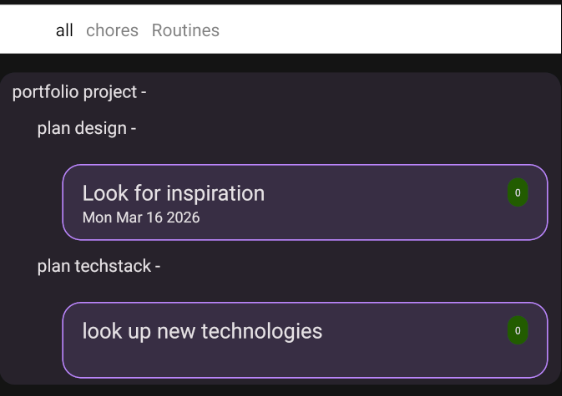
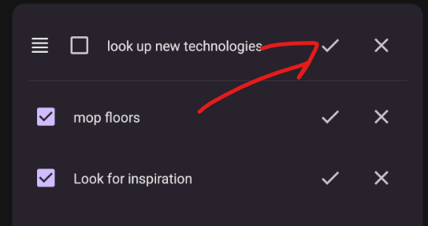
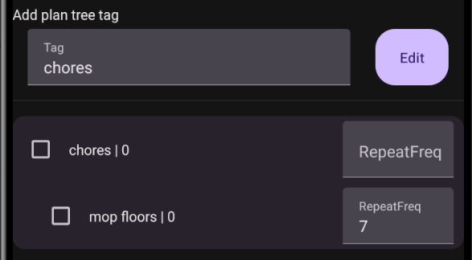
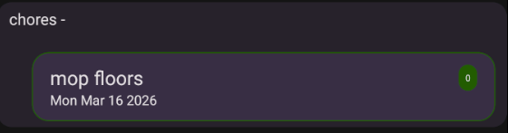
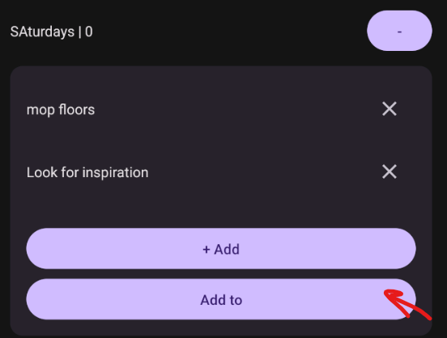
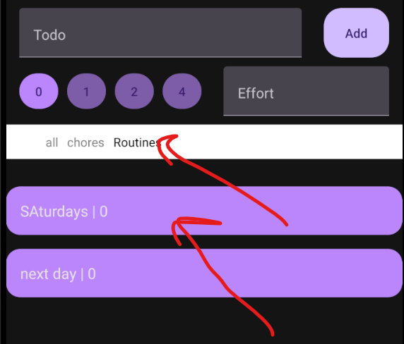

## Day Planner App

I made this app as a way to organize and plan my usual day to day ʕ·͡ᴥ·ʔ

At it's simplest it can be a TO-DO app that allows creating a list of tasks for each current day. And for more features, well you can check the features section (づ ￣ ³￣)づ
By design it is not connected to any services and persists all data locally into the database. So no need for an internet connection to plan your day! It does have data backup and restore functionality, however, to safeguard your routines and many plans.

### Technologies

- Expo & Expo Router
- React Native & React
- TypeScript
- React Navigation
- Redux Toolkit & React Redux
- React Native Paper
- Expo SQLite

### Running the project

1. Install dependencies

   ```bash
   npm install
   ```

2. Start the app

   ```bash
    npx expo start
   ```

In the output, you'll find options to open the app in a

- [development build](https://docs.expo.dev/develop/development-builds/introduction/)
- [Android emulator](https://docs.expo.dev/workflow/android-studio-emulator/)
- [iOS simulator](https://docs.expo.dev/workflow/ios-simulator/)
- [Expo Go](https://expo.dev/go), a limited sandbox for trying out app development with Expo

### Features

#### Core TODO Functionality

At base you have the ability to create a new list of todos for the current day, add as many todos as desired, reorder them, delete them, and mark them as complete.


#### Planner functionality

In my app I wanted a place to note down my most often recurring activities, plan various projects, keep track of different hobbies in my life. For that the planner section comes in handy where I can map out different activities with an endless list of sub categories.


You can enter a plan tree edit screen and edit individual plan items as well as the parent tag.


You can add the base categories straight into your daily todos list.


TODOs added from plan items will also have a check button to complete the plan item if the task is completely done!


**Repeat frequency**: For repeating tasks that you want to do at regular intervals, for example change bedsheets once a week, you can set a repeating frequency for a planned item in the plan edit screen. It accepts a number that represents how many days we want to pass before repeat the task. When selecting the task from the create task screen. It will have a different border depending on how many days it's been since last completion.
Green - done recently, orange - will have to do soon, red - the date has passed, you might want to do it.


#### Routines functionality

Routines can house collections of task lists for repeating occasions or if you want to pre-plan a specific event and already have the tasks ready.


They can be added to a todo list from the routines screen or in the create todo screen in the routines section


#### Energy/Effort system

To try to mitigate overloading a day, you can set an energy level for a given day and assign effort levels for any todo, plan, or routine items. These aren't set to anything specific. I usually view them as 1 effort point is about half an hour of time taken or more if it is something more mentally taxing, like doing taxes ʕノ•ᴥ•ʔノ ︵ ┻━┻

